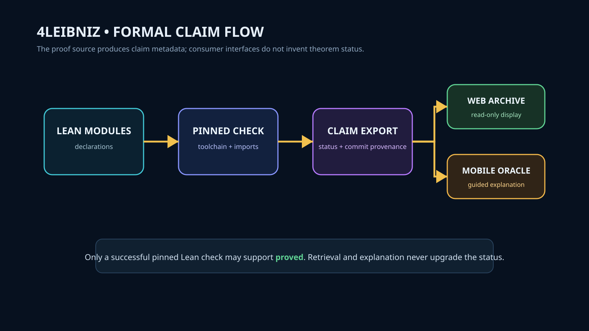

# 4Leibniz

Formal Relational Information Geometry & Automated Verification in Lean 4 — Dedicated to Gottfried Wilhelm Leibniz.



## System Role

`4Leibniz` is the canonical mathematical and formal proof source of truth across the Chyren constellation. It provides formalizations of relational information geometry, epistemic logic, and classical philosophical foundations in Lean 4.

Downstream consumer applications—including `4leibniz-web` (scholarly archive) and `leibniz-oracle` (interactive mobile guide)—consume versioned proof artifacts emitted by this repository. Neither consumer maintains an independent theorem database or has authority to assert that a theorem is proved.

## Active Workstreams

- **Issue #11**: Publish a proof-grounded formal-claim export for `4leibniz-web` and `leibniz-oracle` (`artifacts/v1/formal-claims.json`).
- **Issue #10**: Consume RYTT via `integration/4leibniz_bridge.json` — symbolic notation and interchange layer without forking the grammar.

## Architecture

```
Lean Source (Leibniz/*.lean) ──► Pinned Lake Check ──► Export Generator ──► artifacts/v1/formal-claims.json
                                                           │
                                                           ├──► 4leibniz-web (scholarly display)
                                                           └──► leibniz-oracle (guided learning)
```

## Epistemic Standard

- A claim receives status `proved` **only** when the pinned Lean toolchain compiles the declaration without unresolved `sorry` placeholders or non-standard axioms.
- In-progress, conditional, or philosophical claims remain labeled as `conditional`, `informal`, or `open_problem`.
- Explanation and retrieval in web/mobile interfaces never elevate an unverified claim to `proved`.

## Toolchain & Verification

- **Lean Toolchain**: Pinned in `lean-toolchain`.
- **Manifest**: `lake-manifest.json` tracks locked package dependencies.
- **Lakefile**: `lakefile.lean` defines the core `Leibniz` library target.
- **Test Suite**: Multi-phase verification covering phases 2–12, security hardening, consensus, and RYTT bridge (`tests/`).

```bash
# Build formal library
lake build

# Run Python verification suite
pytest tests/
```
