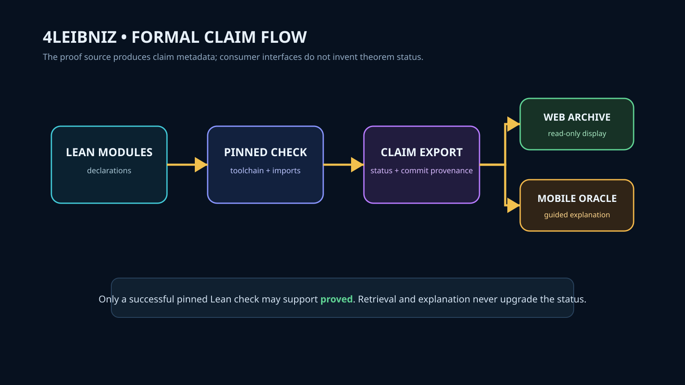

# 4Leibniz

[](https://github.com/Mega-Therion/4Leibniz/actions/workflows/verify.yml)
[](scripts/check_sorries.py)
[](https://doi.org/10.5281/zenodo.21539453)

<p align="left">
  <a href="https://huggingface.co/datasets/ChyRho/4leibniz"></a>
  <a href="https://orcid.org/0009-0001-1303-7190"></a>
  <a href="https://resnova-hub-f4ucvy3e.manus.space"></a>
  <a href="https://www.linkedin.com/in/r-w-yett/"></a>
  <a href="https://x.com/_chyrho_"></a>
</p>

Formal Relational Information Geometry & Automated Verification in Lean 4 — Dedicated to Gottfried Wilhelm Leibniz.



## System Role

`4Leibniz` is the canonical mathematical and formal proof source of truth across the Chyren constellation. It provides formalizations of relational information geometry, epistemic logic, and classical philosophical foundations in Lean 4.

Two consumer applications live alongside the Lean library: [`apps/web`](apps/web/) (scholarly archive, formerly the `4leibniz-web` repository) and [`apps/oracle`](apps/oracle/) (interactive mobile guide, formerly `leibniz-oracle`), merged here on 2026-10-03. Both consume the versioned proof artifacts emitted by the Lean build. Neither maintains an independent theorem database or has authority to assert that a theorem is proved.

## AI Safety & Scalable Oversight Utility

Modern reinforcement learning from human/evaluator feedback (RLHF/RLAIF) is vulnerable to *sycophancy* and *vacuous theorem satisfaction*, where language models satisfy logical goals trivially (e.g., conditioning on $P \wedge \neg P$) or mirror false authoritative prompts.

`4Leibniz` serves as a deterministic verification check for automated reasoning. The kernel rules out unelaborated and `sorry`-backed claims; on its own it cannot rule out a true-but-vacuous or mis-specified statement, which is what the antecedent checks below are for:
- **Zero-Sorry Kernel Elaboration**: Every formal derivation is checked down to foundational proof terms via the Lean 4 kernel, eliminating unelaborated claims.
- **Non-Vacuous Antecedent Enforcement**: Automated test suites check theorem hypotheses for non-trivial model witnesses, preventing models from exploiting the principle of explosion ($P \implies Q$ when $P \equiv \bot$).
- **Machine-Verifiable Proof Receipts**: CI builds emit structured `proof-receipt.json` artifacts, providing tamper-evident telemetry for neuro-symbolic and process-reward oversight benchmarks.

## Active Workstreams

- **Open problem `chiral-floor` — CLOSED 2026-09-12**: the continuity floor `chiFloor = 1/√2` is derived from first principles as the equipartition bound of the vis viva (`Leibniz.VisViva.chiral_dominance_ge_floor`, `Leibniz.LexContinuitatis.chiFloor_is_dyadic_floor`): the stronger member of any dyad carries at least half the total living force, with equality exactly at equipartition. `chiFloor_lt_chiCeil` was promoted from a bare axiom to a theorem in the same pass.

- **Issue #11**: Publish a proof-grounded formal-claim export for `apps/web` and `apps/oracle` (`artifacts/v1/formal-claims.json`).
- **Issue #10**: Consume RYTT via `integration/4leibniz_bridge.json` — symbolic notation and interchange layer without forking the grammar.

## Architecture

```
Lean Source (Leibniz/*.lean) ──► Pinned Lake Check ──► Export Generator ──► artifacts/v1/formal-claims.json
                                                           │
                                                           ├──► apps/web (scholarly display)
                                                           └──► apps/oracle (guided learning)
```

## Epistemic Standard

- A claim receives status `proved` **only** when the pinned Lean toolchain compiles the declaration without unresolved `sorry` placeholders or non-standard axioms.
- In-progress, conditional, or philosophical claims remain labeled as `conditional`, `informal`, or `open_problem`.
- Explanation and retrieval in web/mobile interfaces never elevate an unverified claim to `proved`.

## Toolchain & Verification

- **Lean Toolchain**: Pinned in `lean-toolchain`.
- **Manifest**: `lake-manifest.json` tracks locked package dependencies.
- **Lakefile**: `lakefile.lean` defines the core `Leibniz` library target.
- **Test Suite**: Multi-phase verification covering phases 2–12, security hardening, consensus, and RYTT bridge (`tests/`).

```bash
# Build formal library
lake build

# Run Python verification suite
pytest tests/
```
