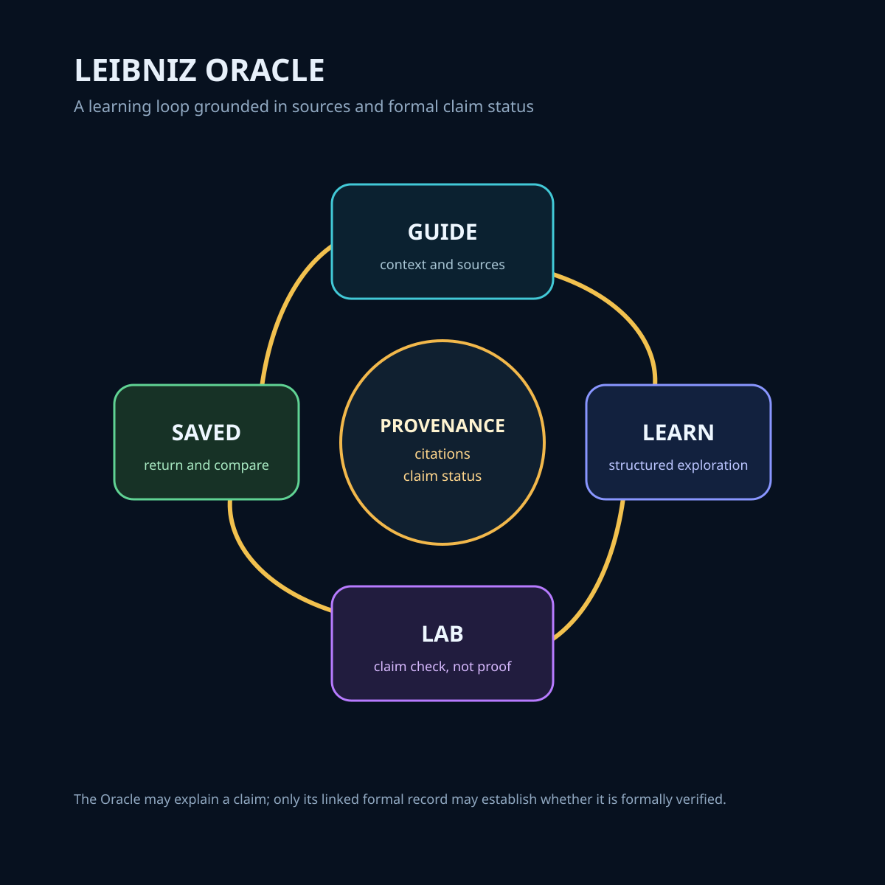

# Leibniz Oracle

> Merged into the `4Leibniz` repository on 2026-10-03 from the former `leibniz-oracle` repository (master @ 328d373), as a snapshot without its earlier commit history. Paths in this file are relative to `apps/oracle/`.

An interactive mobile companion for the 4Leibniz formalization project: explore the codebase, run conceptual claim checks, learn about Leibniz, and interact with a repo-aware guide.



## System Role & Mobile Experience

`leibniz-oracle` brings the 4Leibniz corpus and formalization work to mobile devices (iOS / Android / Web) via Expo and React Native. It structures user exploration into four interconnected workflows:

1. **Guide**: Conversational repo-aware guide grounded strictly in corpus passages and source citations.
2. **Learn**: Structured educational pathways exploring Leibnizian philosophy and relational geometry.
3. **Lab**: Conceptual claim checker. Compares user-formulated propositions against formal Lean theorems.
4. **Saved**: Bookmarked passages, theorem references, and past conversational sessions.

## Epistemic Guardrails (Lab vs. Proof)

- **The Lab Checks Consistency, Not Truth**: The mobile Lab checks conceptual alignment with formal declarations. It does **not** evaluate Lean 4 code or generate mathematical proofs.
- **Upstream Formal Catalog**: Consumes `artifacts/v1/formal-claims.json` emitted by canonical `4Leibniz` (`Mega-Therion/4Leibniz` #11).
- **No Badge Inflation**: A claim is never displayed as `proved` in the mobile interface without an exact, commit-pinned verification record from the upstream Lean compiler.

## Architecture & Tech Stack

```
Mobile Client (Expo / NativeWind) ──► Fastify Server Router ──► Read-Only Formal Catalog
   ├── (tabs)/guide.tsx                  (server/routers.ts)    (artifacts/v1/formal-claims.json)
   ├── (tabs)/learn.tsx                           │
   ├── (tabs)/lab.tsx                             ▼
   └── (tabs)/saved.tsx                  Local Session Storage
                                          (server/storage.ts)
```

## Local Development

```bash
# Install dependencies
pnpm install --frozen-lockfile

# Start Expo dev server
pnpm run dev

# Run test suite
pnpm test
```
