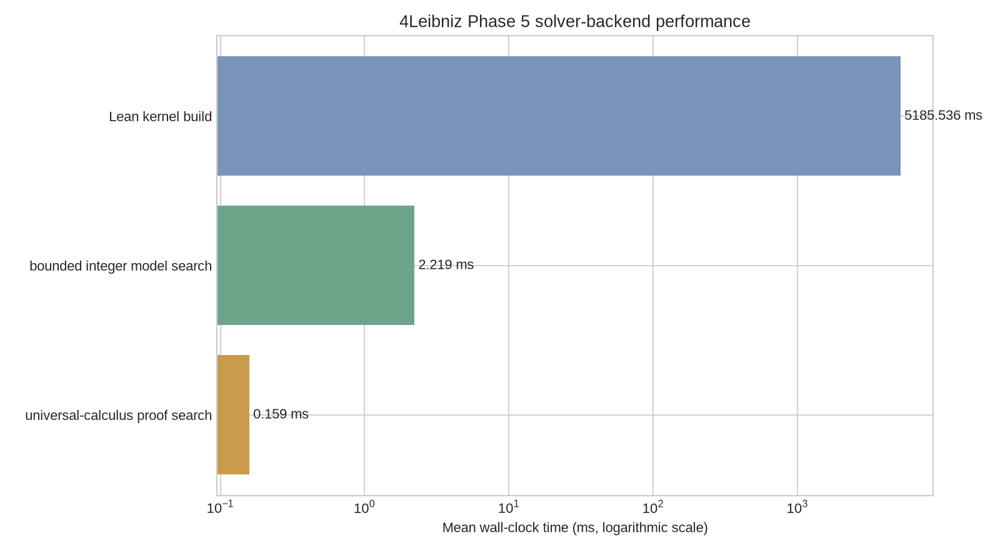
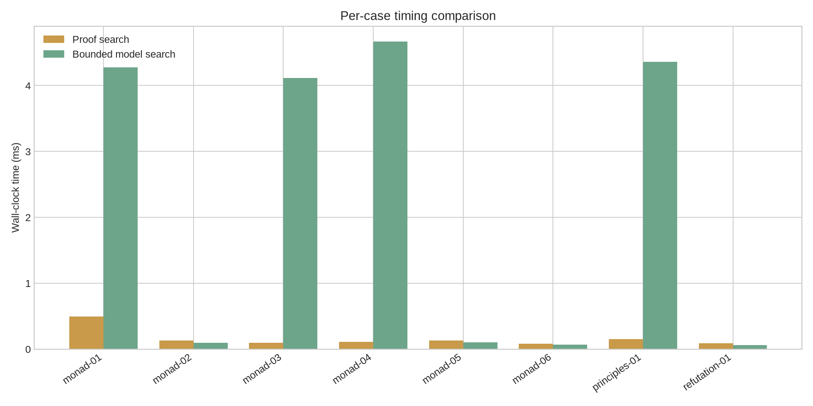

# 4Leibniz Phase 5 Performance Report

Corpus: `leibniz-philosophical-benchmark-v1`

Wall-clock local timings; compare only within the same environment. Unavailable backends are not imputed.

## Backend summary

| Backend | Status | Mean time (ms) |
|---|---:|---:|
| universal-calculus proof search | available | 0.159 |
| bounded integer model search | available | 2.219 |
| Lean kernel build | available | 5185.536 |
| Z3 SMT | unavailable | None |
| CVC5 SMT | unavailable | None |

## Interpretation

The chart compares only backends that were actually available in this environment. Wall-clock measurements are local regression signals, not portable claims about absolute performance. Unavailable SMT backends are retained as explicit gaps rather than being assigned fabricated timings.

Unavailable backends: Z3 SMT, CVC5 SMT.
